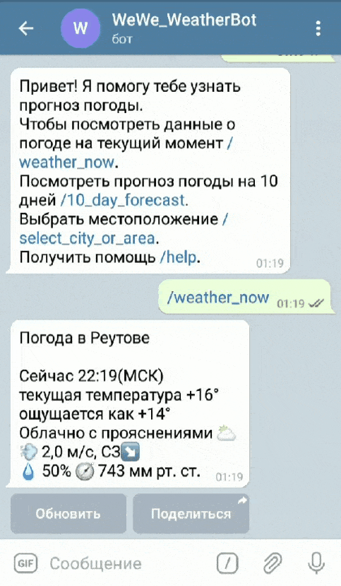

# PythonWeatherTeleBot
:partly_sunny:  Telegram bot for showing weather
# About PythonWeatherTeleBot:
A pretty simple telegram bot for showing the weather on the territory of Russia.<br>
The data is parsed with [Yandex.Weather](https://yandex.ru/pogoda/).<br>
The interface is in Russian.
# Features:
 - weather now
 -  
 - 10-day weather forecast
 - 
 - choosing the weather in the right city or area
 - 
 - storing user parameters for the bot operation
# For running application:
 * [Python 3.8.6](https://www.python.org/downloads/release/python-386/)
 * [pyTelegramBotAPI 3.8.2](https://pypi.org/project/pyTelegramBotAPI/)
 * [beautifulsoup4 4.9.3](https://pypi.org/project/beautifulsoup4/)
 * [lxml 4.6.3](https://pypi.org/project/lxml/)
 * [requests 2.25.1](https://pypi.org/project/requests/2.25.1/)
 * [psycopg2 2.9.1](https://pypi.org/project/psycopg2/)
 * [PostgreSQL](https://www.postgresql.org/download/)
# Getting started.
 - create a Telegram bot using [@BotFather](https://telegram.me/BotFather)
    It needs to be configured. Need to add:
      - a description and text about the bot (commands /setdescription and /setabouttext)
      - a profile photo (/setuserpic)
      - enable the inline mode (/setinline)
      - add command descriptions (/setcommands):
        weather_now - погода сейчас<br>
        10_day_forecast - прогноз погоды на 10 дней<br>
        choosing city or area - изменение места для прогноза погоды<br>
        help - помощь<br>
  - save the token to a config_tb.py
      ```python
      TOKEN = '<your_token>'
      ```
 - create a table in the selected database to store user properties:
    - configure the PostgreSQL login for use in config.db(example)
     ```python
     pyconfig = {
           'user': 'postgres', 
           'password': '<randompassword>',
           'host': '127.0.0.1',
           'port': '5432',
           'database': '<randomdatabase>'
           }
    ```
   - launch create_table.py
   - or set the path to the file in the SQL shell
     ```SQL shell
     SOURCE users_property.sql
     ```
  - launch main.py
